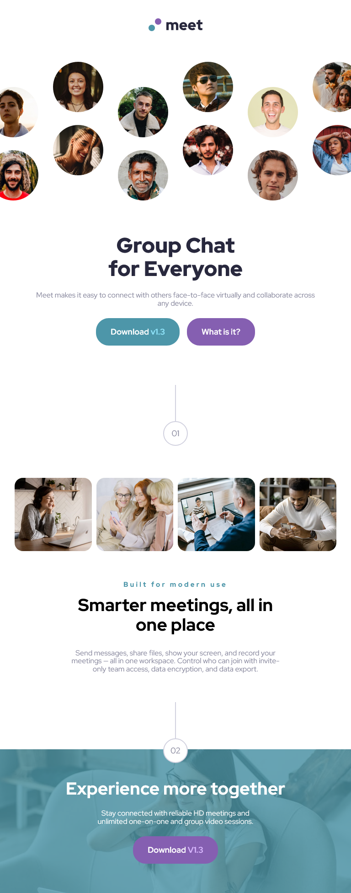
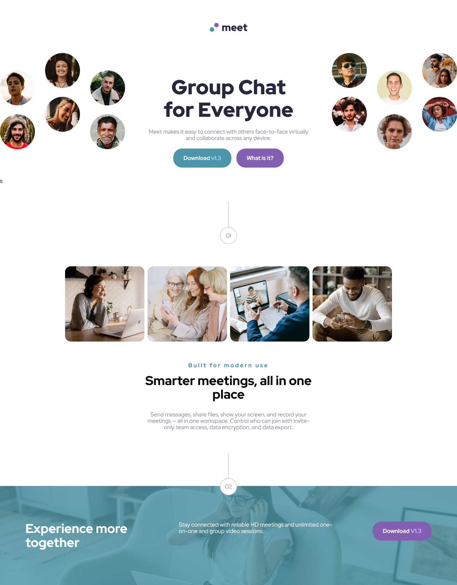

# Frontend Mentor - Meet landing page solution

This is a solution to the [Meet landing page challenge on Frontend Mentor](https://www.frontendmentor.io/challenges/meet-landing-page-rbTDS6OUR). Frontend Mentor challenges help me improve my coding skills by building realistic projects.

## Table of contents

- [Overview](#overview)
  - [The challenge](#the-challenge)
  - [Screenshot](#screenshot)
  - [Links](#links)
- [My process](#my-process)
  - [Built with](#built-with)
  - [What I learned](#what-i-learned)
- [Author](#author)

## Overview

### The challenge

Users should be able to:

- View the optimal layout depending on their device's screen size
- See hover states for interactive elements

### Screenshot

  <figure>
    <figcaption>Mobile</figcaption>
    
  </figure>

  <figure>
    <figcaption>Tablet Screen Size</figcaption>
    
  </figure>

  <figure>
    <figcaption>Desktop Screen Size</figcaption>
    
  </figure>

### Links

- Solution URL: [Add solution URL here](https://your-solution-url.com)
- Live Site URL: [Add live site URL here](https://your-live-site-url.com)

## My process

### Built with

- Semantic HTML5 markup
- CSS custom properties
- Flexbox
- CSS Grid
- Mobile-first workflow

### What I learned

I learned how to structure layouts using CSS Grid and Flexbox not just for individual components, but for entire page layouts. As the structure became more complex, I realized the importance of writing clear and precise layout code to keep it maintainable and scalable in the future.

## Author

- Github - [@pete13232](https://github.com/pete13232)
- Frontend Mentor - [@pete13232](https://www.frontendmentor.io/profile/pete13232)
